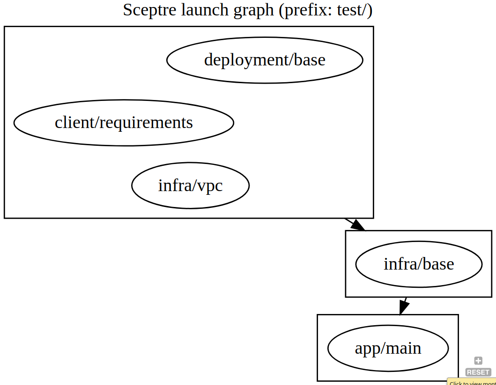

[](https://badge.fury.io/py/sceptre-dot)


Helps you visualise your Sceptre projects with Graphviz (DOT). Get started by running `pip install sceptre-dot`



# Benefits
- Visualisation can be added as a documentation artefact to your project
- Having many explicit/implicit dependencies can slow down deployments. Use the generated dependency graph to quickly spot bottlenecks due to these dependencies. 

# Installation

Install graphviz for your operating system as per [official instuctions](https://graphviz.gitlab.io/download/).

Install this package in the same python interpreter (virtualenv) that Sceptre is installed so that its python library is already available:
`pip install sceptre-dot`

# Usage
In the same directory where you would normally invoke `sceptre launch -y $YOUR_PATH`, run: 

```bash
sceptre-dot $YOUR_PATH > output.dot
fdp -Tpng output.dot -o output.png # use fdp engine for best results
```
If you can't or don't want to install graphviz, you can paste the outputted dot file in an online viewer like [viz-js](http://viz-js.com/). (Be sure to choose the **fdp** engine) 


Released under the Simplified BSD Licence.
